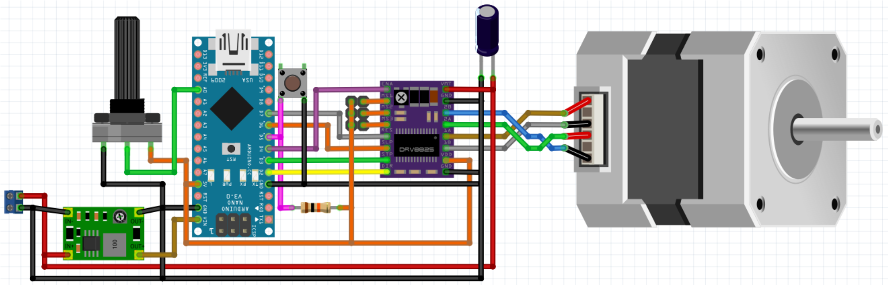

# ArduinoStepperTester
Test stepper motors and drivers using an Arduino Nano.

## Usage

The test station has a potentiometer which controls the speed and a switch which reverses the direction.

Please supply 12 or 24 Volts at the terminal. The power supply should be able to deliver up to 2 A with regular stepper drivers. If the voltage drops because of a too weak power supply the motor may behave strangely.

For wiring the motor you can use a cable with a crimped JST-PH connector (4 Poles). These cables are supplied with the motors and are usually bundled in 3D printer kits.
A JST-PH socket can also be used with DuPont connectors. Be aware that these connetors can not handle as high currents as the ones from JST.

As a stepper driver all the usual socketed driver borads are usable. This includes Pololu A4988, Ti DRV8825, TMC 2208 and TMC2209. Please refer to the datasheet of the driver for the micostepping configuration. The board supperts jumpers for MS0, MS1 and MS2 but not all drivers use all three configuration pins.

**Be aware that the Arduino Nano is too slow to send enough step signals to the driver to make the motor go really fast. This is even more the case if you configure a lot of microsteps like 32. If you want to test the torque of your stepper at high rpm you have to use another tester.**

## Building this tester

You can use the fritzing file in the `schematic/` folder and order a PCB. However you may also print the pcb design at scale, glue it to a prototyping board with striped connections and simply cut the connections with a 3mm drill where needed. For a small design like this one this is fast and relatively easy.
